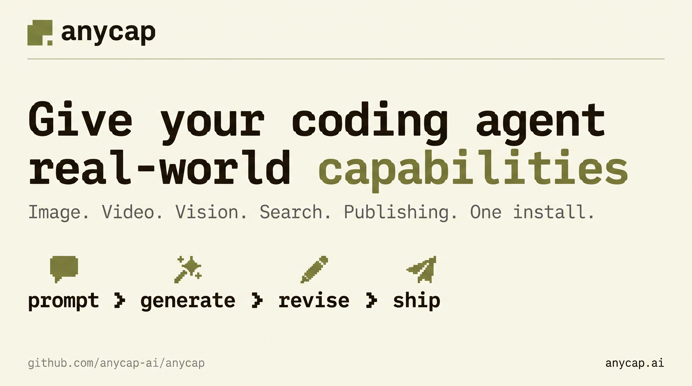

# AnyCap

> Give Claude Code, Cursor, and Codex real-world capabilities.
> One install for image, video, vision, music, web search, and publishing — inside the agents you already use.
> Install in plain English. No `npm` vs `brew` vs `curl` debate.



## What this fixes

Your coding agent can reason and write code. It still can't ship a meme, generate a hero image, analyze a screenshot a user dropped in, search the live web, or publish a landing page. AnyCap is the missing execution layer — multimodal, web, and delivery behind one CLI and one auth.

## What your agent can do after installing AnyCap

### 1. Make a meme end-to-end

Agent drafts the caption, generates the image, revises the visual, then returns a shareable link.

<!--  -->


```bash
anycap image generate --prompt "cat in a tiny chef hat, meme caption 'ship it'" \
  --model nano-banana-2 -o meme.png
anycap image generate --prompt "make the caption bigger and yellow" \
  --model nano-banana-2 --mode image-to-image --param images=./meme.png -o meme-v2.png
anycap drive upload meme-v2.png --parent-path /memes
anycap drive share --src-path /memes/meme-v2.png
```

### 2. Turn a prompt into a hosted page

Agent writes the copy, generates hero visuals, and deploys a live URL.

<!--  -->


```bash
anycap image generate --prompt "abstract product hero, soft gradient" \
  --model nano-banana-2 -o ./dist/hero.png
anycap page deploy ./dist --name "launch-page" --publish
```

### 3. Review a screenshot with a human in the loop

Agent opens the annotation UI, the human marks issues, the agent reads the feedback and revises.

<!--  -->


```bash
anycap annotate ./screenshot.png --no-wait
anycap annotate poll --session ann_xxxx
anycap actions image-read --file ./screenshot-annotated.png \
  --instruction "List every change requested by the annotations"
```

## Install by talking to your agent

AnyCap installs itself in plain English. No package-manager dance, no doc spelunking, no version pinning. Hand the paragraph below to Claude Code, Cursor, Codex, or any agent that can run shell — it reads `llms.txt`, installs the CLI, installs the skill, opens the browser to log you in, and verifies the connection.

```text
Read https://raw.githubusercontent.com/anycap-ai/anycap/main/llms.txt and follow the instructions to install AnyCap CLI and skill. If you can't access the URL, run these commands instead:
1. curl -fsSL https://anycap.ai/install.sh | sh
2. npx -y skills add anycap-ai/anycap -s '*' -g -y
3. anycap login
4. anycap status
Learn more at https://anycap.ai
```

After that one paste, everything else is just conversation. The skill teaches the agent the full command surface, so future actions become one sentence:

- **"Upgrade AnyCap and check my status."**
- **"Generate a hero image for the launch page and deploy it."**
- **"Search the web for the latest Cursor changelog and summarize."**

The agent picks the right capability, runs it, and hands you the result. You never touch a flag unless you want to.

Prefer to drive it yourself? See [Manual install](#manual-install) below.

______________________________________________________________________

## Manual install

### Install the CLI

macOS / Linux / Windows (Git Bash):

```bash
curl -fsSL https://anycap.ai/install.sh | sh
```

npm (all platforms):

```bash
npm install -g @anycap/cli
```

Or grab a binary from [GitHub Releases](https://github.com/anycap-ai/anycap/releases).

### Install the skill

Works with Claude Code, Cursor, Windsurf, OpenCode, and [40+ agents](https://skills.sh):

```bash
npx -y skills add anycap-ai/anycap -s '*' -g -y
```

### Verify

```bash
anycap login
anycap status
```

## More ways to install the skill

```bash
# Direct download
curl -fsSL https://raw.githubusercontent.com/anycap-ai/anycap/main/skills/anycap-cli/SKILL.md \
  --create-dirs -o ~/.agents/skills/anycap-cli/SKILL.md

# Via AnyCap CLI
anycap skill install --target ~/.agents/skills/anycap-cli/

# Check if skill is up to date
anycap skill check --target ~/.agents/skills/anycap-cli/SKILL.md
```

## Capabilities

| Capability                    | Command                                                              | What agents do with it                          |
| ----------------------------- | -------------------------------------------------------------------- | ----------------------------------------------- |
| Image generation / edit       | `anycap image generate` (`--mode image-to-image` for edits)          | Hero art, meme assets, illustration, photo edit |
| Image / video / audio reading | `anycap actions image-read` / `video-read` / `audio-read`            | Screenshot review, meeting transcripts, QA      |
| Video generation              | `anycap video generate`                                              | Demo clips, animated assets                     |
| Music generation              | `anycap music generate`                                              | Jingles, soundtracks                            |
| Web search                    | `anycap search --query` (general) / `--prompt` (grounded with cites) | Live answers, research                          |
| Web crawl                     | `anycap crawl <url>`                                                 | Any URL into clean Markdown                     |
| Annotate                      | `anycap annotate`                                                    | Human-in-the-loop visual feedback               |
| Draw                          | `anycap draw`                                                        | Live whiteboard / Mermaid diagrams              |
| Drive                         | `anycap drive upload` / `share`                                      | Shareable file links                            |
| Page                          | `anycap page deploy`                                                 | Hosted static pages                             |
| Download                      | `anycap download`                                                    | Save any remote file                            |

Coming soon: TTS / voice synthesis.

## Works with

Claude Code · Cursor · Codex · Windsurf · OpenCode · 40+ agents via [skills.sh](https://skills.sh).

## Links

- [llms.txt](llms.txt) — Give this to your agent
- [Skill File](skills/anycap-cli/SKILL.md) — Full capability documentation
- [GitHub Releases](https://github.com/anycap-ai/anycap/releases) — CLI binaries
- [skills.sh](https://skills.sh/anycap-ai/anycap) — Skills directory listing
- [Website](https://anycap.ai)

## License

MIT
