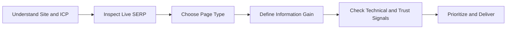

# AnyCap AI Tool SEO

> **Read this entire file before starting.** It covers the full SEO planning and audit workflow for AI tool websites.

Plan and audit SEO for AI tool websites. Focus on product-led SEO where each page should help a searcher complete a task, evaluate options, or enter the product with high intent.

**Map intent. Shape pages. Add evidence. Protect quality.**

## Before You Start

**Read all three reference files before taking any action.** They contain the working framework, page planning rules, and quality guardrails.

1. Read this file for the overview and process
2. Read the references in this order:
   - [framework.md](references/framework.md)
   - [page-planning.md](references/page-planning.md)
   - [guardrails.md](references/guardrails.md)
3. Then begin the workflow below

For detailed command syntax, flags, and output parsing, refer to the **anycap-cli** skill.

## Prerequisites

- `anycap` CLI installed and authenticated (`anycap status` to verify)
- A local workspace for notes, saved search results, and page briefs

## When to Use This Skill

- AI tool website SEO planning
- SaaS or product-led SEO audits
- Search intent to page type mapping
- Page brief creation for tool, comparison, alternatives, pricing, and tutorial pages
- Technical SEO prioritization for new or growing tool websites
- Citation, directory, or backlink planning
- Programmatic SEO evaluation and rollout gating

## SEO Planning Process



Work through the steps below in order. Skip only when you already have high-confidence answers.

### 1. Understand the site and the searcher

- Crawl the homepage, pricing page, docs/help center, and one representative tool or feature page.
- Infer:
  - the core job-to-be-done
  - primary user, buyer, and learner
  - target geography and language
  - primary conversion event
- Use the 6-field ICP template in [framework.md](references/framework.md).
- If the user only provides a URL, infer first and ask follow-up questions only when the missing context would materially change the plan.

### 2. Inspect the live SERP before recommending content

- Do not decide the content format from the keyword alone.
- Use `anycap search --query "<keyword>" --no-crawl --max-results 10` to classify dominant page types, recurring modules, and SERP mix.
- Treat search intent as a page-shape constraint, not just a label.
- If the SERP is mixed, decide whether the keyword deserves one page with a dominant intent or multiple pages.
- Use [page-planning.md](references/page-planning.md) for page type mapping and module requirements.

### 3. Evaluate page viability through four lenses

- Review every page or keyword cluster through:
  - **Search-Fit Product**: Can the user complete the task on the page or move naturally into the product?
  - **Information Gain**: What first-hand evidence, screenshots, data, tests, workflows, or examples make this page stronger than the current SERP?
  - **Technical Readiness**: Can search systems crawl, index, render, and understand the page?
  - **Trust Distribution**: What internal links, external mentions, backlinks, directory placements, or trust blocks support the page?
- Use "Last-Click" only as a user-satisfaction heuristic. Do not present it as an official Google ranking factor. See [guardrails.md](references/guardrails.md).

### 4. Prioritize the plan

- Default prioritization:
  1. money pages with clear transactional or commercial intent
  2. comparison, alternatives, and pricing pages
  3. tutorials that support discovery, trust, and internal linking
  4. pSEO only after a small set of hard pages proves quality and indexation
- Separate:
  - high-confidence rules
  - practitioner heuristics
  - assumptions that still need validation

### 5. Deliver concrete outputs

- Default deliverables:
  - ICP summary
  - keyword cluster -> intent -> page type table
  - priority page briefs
  - technical baseline checklist
  - citations / backlinks backlog
  - pSEO go / no-go decision with safeguards
  - 30 / 60 / 90 day sequencing

## Human-in-the-Loop

This skill benefits from light user input up front, but should otherwise run autonomously.

- Ask for the site URL, target market, and conversion goal if they are not clear.
- If the user already gave a concrete site or keyword set, do not over-clarify.
- Once direction is clear, continue through SERP inspection, planning, and prioritization without repeated interruptions.

## Core Principles

**Define the searcher before the keyword.** A keyword only makes sense once you know who is searching, why, and what they need to finish.

**Inspect the live SERP before choosing a page type.** Do not recommend a tutorial, comparison, or tool page until you know what the current SERP rewards.

**Treat page type as intent execution.** A page is not just content; it is the shape through which the intent gets fulfilled.

**Require evidence, not generic prose.** Information gain should come from screenshots, examples, data, workflows, benchmarks, or other concrete proof.

**Protect quality before scale.** Do not recommend pSEO until high-value sample pages have proven useful, indexable, and maintainable.

**Separate rules from heuristics.** Be explicit about what is a hard constraint versus what is a useful but situational tactic.

## Quick Reference

```bash
# Inspect a target site
anycap crawl https://example.com

# Inspect the SERP shape for a keyword
anycap search --query "best ai headshot generator" --no-crawl --max-results 10

# Ask for a grounded summary when the SERP is unclear
anycap search --prompt "What page types dominate the SERP for 'best ai headshot generator' and which content blocks recur?"
```

Save important search and crawl outputs locally when the task is large or when you expect to revisit evidence.

## Guardrails

- Do not promise rankings.
- Do not recommend doorway pages, spun pages, or low-value mass AI pages.
- Do not copy a competitor layout blindly; infer the SERP expectation, then add original evidence.
- Treat numeric thresholds, directory filters, and DR/DA cutoffs as heuristics rather than fixed rules.
- Flag compliance risk when recommending paid placements, sponsored links, or directory submissions.
- When suggesting pSEO, require unique fields, update mechanisms, quality checks, and pruning rules.

## Resources

- [framework.md](references/framework.md) -- core model, support levels, and default prioritization
- [page-planning.md](references/page-planning.md) -- intent mapping, page modules, and page brief outputs
- [guardrails.md](references/guardrails.md) -- quality boundaries, safety checks, and pSEO gating
