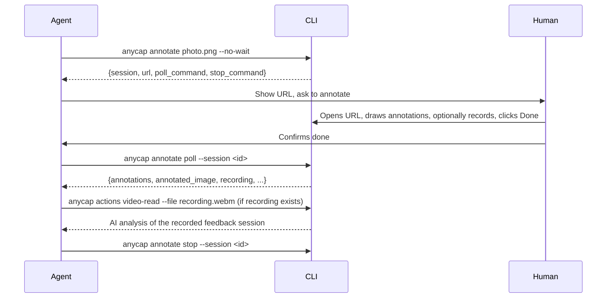

# Annotate

Interactive browser-based annotation and feedback tool. Opens a visual editor where humans draw annotations (rectangles, arrows, points, freehand) with text labels, and optionally record screen video with voice narration. Supports four media types and real-time multi-user collaboration (image, video, audio; URL mode is single-user).

Use annotation when you need structured visual feedback from a human -- pointing at specific regions, marking desired changes, or recording a narrated walkthrough that you can analyze with `anycap actions video-read`.

## Supported Media Types

| Type | Auto-detected by | What the human sees | Annotated image | Recording |
|------|-------------------|---------------------|-----------------|----------|
| Image | File extension (.png, .jpg, .webp, ...) | Image with annotation overlay | Yes (original + annotations composited) | Yes |
| URL | `http://` or `https://` prefix | Live iframe with annotation overlay + Browse mode | No (cross-origin) | Yes |
| Video | File extension (.mp4, .webm, .mov, ...) | Video player with annotation overlay | Yes (current frame + annotations) | Yes |
| Audio | File extension (.mp3, .wav, .ogg, ...) | Audio player with drawing canvas | Yes (canvas + annotations) | Yes |

## Multi-User Collaboration

> **URL/iframe mode is single-user only.** The screen recording is the primary feedback artifact in URL mode, and multiple users' cursors and annotations would make the recording confusing. Collaboration features below apply to image, video, and audio modes.

Multiple users can open the same annotation URL simultaneously. All annotation changes and cursor positions sync in real-time via WebSocket. Each client gets a random animal name (e.g., "Swift Fox") and color for identification. In non-blocking mode (`--no-wait`), when any participant clicks **Done**, others see a toast notification and can continue editing. In blocking mode (default), clicking Done ends the session for all collaborators.

This is especially useful for team review sessions on shared servers:

```bash
# Start on a LAN/public server so teammates can join
anycap annotate design.png --no-wait --bind 0.0.0.0 --port 8888
```

Share `http://<server-ip>:8888` with your team. Everyone can annotate and see each other's cursors in real-time.

**Security note:** The annotation server uses CSRF protection for write operations but does not enforce its own access control. When binding to `0.0.0.0` on a public network, use a reverse proxy with authentication (basic auth, OAuth proxy, VPN) to restrict access. On a trusted LAN, direct access is fine.

## Recording

The Rec button captures the full browser tab as a video file (via `getDisplayMedia`). The human can narrate with their microphone while annotating. The resulting `.webm` video captures everything visible in the tab -- the content, annotations being drawn, and voice commentary.

**Key insight for agents:** Use `anycap actions video-read` on the recording to get AI video understanding of the feedback session. This lets you "watch" what the human did and said, even for complex spatial feedback that is hard to express in text annotations alone.

## Recording Permission Note

The Rec button uses the browser's `getDisplayMedia` API, which triggers a permission prompt. If the user declines the permission or never clicks Rec, the `recording` field will be absent from the result. Always check for its existence before attempting `video-read`. Text annotations are available regardless of whether a recording was made.

For URL mode, the recording is the **primary** feedback artifact because cross-origin iframe prevents annotated image export. Emphasize recording when presenting URL annotation sessions to the user.

## Browser Auto-Open

Both blocking and non-blocking modes automatically attempt to open the annotation URL in the default browser. In desktop environments, the human sees the annotation UI immediately.

If the browser cannot be opened (headless server, SSH, container), the CLI prints the URL to stderr with a fallback message. No error is raised -- the session proceeds normally.

## Two Modes

| Mode | Flag | Behavior |
|------|------|----------|
| Blocking | (default) | Opens browser, waits for user to click Done, outputs result |
| Non-blocking | `--no-wait` | Starts background server, returns session info immediately |

### Done Button Behavior

The "Done" button in the annotation toolbar behaves differently depending on the mode:

- **Blocking mode**: Clicking Done ends the session. The CLI command returns immediately with the result.
- **Non-blocking mode**: Clicking Done **saves** the current annotations without ending the session. Each subsequent Done overwrites the saved result. The agent retrieves the latest save via `poll`.

In collaborative modes (image, video, audio), other connected users see a notification when someone clicks Done. In non-blocking multi-user sessions, reviewers can save independently without disrupting each other.

## Blocking Mode

Best for direct human interaction. Opens the browser automatically.

```bash
anycap annotate photo.png
anycap annotate https://localhost:3000
anycap annotate output.mp4
anycap annotate song.mp3
```

The command blocks until the user clicks Done in the browser. It then outputs the annotation result as JSON to stdout and prints a human-readable summary to stderr.

## Non-blocking Mode (Agent Workflow)

Best for agents that need to hand off annotation to a human asynchronously.



### Step 1: Start

```bash
anycap annotate photo.png --no-wait
```

Response:

```json
{
  "status": "started",
  "session": "ann_a1b2c3d4",
  "url": "http://127.0.0.1:54321",
  "poll_command": "anycap annotate poll --session ann_a1b2c3d4",
  "stop_command": "anycap annotate stop --session ann_a1b2c3d4",
  "session_file": ".anycap/annotate/ann_a1b2c3d4.json",
  "expires_in": 600,
  "next_action_hint": "The browser opens automatically on desktop; in headless environments share the URL with the user. Tell the user to click Done when finished. Multiple users can open the same URL for real-time collaboration. Users can draw annotations and/or record screen with narration (Rec button). For URL targets, emphasize recording -- it is the primary feedback artifact (no annotated image due to cross-origin). After the user confirms they clicked Done, run poll_command to get the result, then stop_command to shut down. Use `anycap annotate list` to recover sessions after context loss."
}
```

Show the URL to the human. For image/video/audio targets, multiple people can open the same URL to collaborate. Wait for the human to confirm they are done before polling.

**Session recovery:** If you lose track of the session ID or commands, use `anycap annotate list` to see all sessions with their recovery commands. Alternatively, read the `session_file` (`.anycap/annotate/<session_id>.json` in the working directory) directly.

### Step 2: Poll

After the human confirms completion:

```bash
anycap annotate poll --session ann_a1b2c3d4
```

Possible responses:

| Status | Meaning |
|--------|---------|
| `"status": "submitted"` | Feedback available (see full result below) |
| `"status": "pending"` | Human has not clicked Done yet |
| `"status": "expired"` | Session timed out |

### Step 3: Analyze Recording (Optional)

If the result includes a `recording` field, use `anycap actions video-read` to understand the human's narrated feedback:

```bash
anycap actions video-read --file .anycap/annotate/<session>/recording.webm \
  --instruction "Describe what the user is pointing at and what changes they want"
```

### Step 4: Stop

Clean up the background server:

```bash
anycap annotate stop --session ann_a1b2c3d4
```

## Flags

| Flag | Required | Description |
|------|----------|-------------|
| `<target>` | yes | Image file, URL, video file, or audio file |
| `-o, --output` | no | Save annotated image to this path (default: `<name>_annotated.<ext>`) |
| `--no-wait` | no | Start background server and return immediately |
| `--bind` | no | Bind address (default: `127.0.0.1`; use `0.0.0.0` for LAN/remote/headless access) |
| `--port` | no | Server port (default: random; agents should specify a fixed port) |

**Port tip:** Use the same `--port` value across sessions (e.g., `--port 8888`). The browser stores each user's display name in localStorage, which is scoped by origin (host + port). A consistent port means returning collaborators keep their name without re-entering it.

Note: `--json` and `--pretty` are global CLI flags (not annotate-specific) that control output format. Non-TTY environments default to JSON automatically.

### Reverse Proxy Compatibility

The annotation UI works behind reverse proxies with arbitrary path prefixes. All asset, API, and WebSocket URLs are resolved relative to the page URL, so setups like `https://server.com/tools/annotate/ -> http://localhost:8888/` work without configuration. Query parameters (e.g., `?token=...` for proxy-level auth) are preserved on all internal requests automatically.

## Annotation Types

The editor supports four annotation tools plus a browse mode for URL targets:

| Type | Keyboard shortcut | Description |
|------|-------------------|-------------|
| Browse | `B` | (URL mode only) Pass clicks through to the iframe |
| Rectangle | `R` | Draw a bounding box around a region |
| Arrow | `A` | Draw an arrow pointing to or between elements |
| Point | `P` | Mark a specific location |
| Freehand | `F` | Draw freeform shapes or outlines |

Each annotation gets a numbered label and a text input for describing the desired change.

Other shortcuts: `Cmd/Ctrl+Z` = undo, `Esc` = cancel, `Backspace` = delete last.

## Output Format

The annotation result (from both blocking mode stdout and poll response).
Available fields depend on media type:

- **Image**: `annotated_image` + `annotations` + `image_dimensions` + optional `recording`
- **Video**: `annotated_image` (current frame snapshot) + `annotations` + `image_dimensions` + optional `recording`
- **Audio**: `annotated_image` (canvas snapshot) + `annotations` + `image_dimensions` + optional `recording`
- **URL**: `annotations` + optional `recording` (no annotated image due to cross-origin iframe)

```json
{
  "status": "submitted",
  "source": "/path/to/original.png",
  "source_type": "image",
  "annotated_image": "/path/to/original_annotated.png",
  "recording": "/path/to/.anycap/annotate/<session>/recording.webm",
  "recording_duration_seconds": 45,
  "annotations": [
    {
      "id": 1,
      "type": "rect",
      "bounds": {"x": 100, "y": 50, "width": 200, "height": 150},
      "label": "Remove this object"
    },
    {
      "id": 2,
      "type": "arrow",
      "from": {"x": 300, "y": 100},
      "to": {"x": 500, "y": 200},
      "label": "Move this element here"
    },
    {
      "id": 3,
      "type": "point",
      "position": {"x": 400, "y": 300},
      "label": "Change this color to blue"
    },
    {
      "id": 4,
      "type": "freehand",
      "points": [{"x": 10, "y": 20}, {"x": 15, "y": 25}],
      "label": "Outline the area to blur"
    }
  ],
  "image_dimensions": {"width": 1920, "height": 1080},
  "hint": "Use the annotated image with 'anycap image generate --mode image-to-image --param images=<annotated_image>'. Use 'anycap actions video-read' on the recording to understand the user's narrated feedback."
}
```

All coordinates are in **original media pixel space** (not display coordinates). This makes them directly usable as editing instructions regardless of display scaling.

## Using Annotations with Image Generate (image-to-image)

For image and video targets, the annotated image can be fed into `anycap image generate --mode image-to-image` for precise, visually-guided edits. For URL targets, use annotation coordinates and labels to guide source code modifications directly. For audio targets, use the labels to guide regeneration.

```bash
# 1. Human annotates an image
anycap annotate photo.png -o photo_annotated.png

# 2. Use the annotated image as reference for image-to-image generation
anycap image generate \
  --prompt "#1 Remove the object. #2 Move the element following the arrow." \
  --model nano-banana-2 \
  --mode image-to-image \
  --param images=./photo_annotated.png \
  -o photo_edited.png
```

## Using Recordings for Video Understanding

For any media type, the recording captures the full annotation session as video. This is especially valuable for:

- **Complex spatial feedback** that is hard to express in text labels
- **URL reviews** where the human navigates, scrolls, and narrates issues
- **Video/audio feedback** where timing and sequence matter

```bash
# Analyze the recording
anycap actions video-read --file .anycap/annotate/<session>/recording.webm \
  --instruction "List all issues the user pointed out, with timestamps"
```

## Subcommands

### `annotate poll`

Poll for annotation result after the human clicks Done.

```bash
anycap annotate poll --session <session_id>
```

### `annotate stop`

Stop the background annotation server and clean up the session.

```bash
anycap annotate stop --session <session_id>
```

### `annotate list`

List all annotation sessions in the current directory. Shows session ID, status, media type, source, port, and recovery commands.

```bash
anycap annotate list
```

Output:

```json
{
  "sessions": [
    {
      "session": "ann_a1b2c3d4",
      "status": "pending",
      "media_type": "image",
      "source": "/path/to/photo.png",
      "port": 54321,
      "poll_command": "anycap annotate poll --session ann_a1b2c3d4",
      "stop_command": "anycap annotate stop --session ann_a1b2c3d4"
    }
  ],
  "count": 1
}
```

Use `list` to recover session details after a context reset or when you have lost track of active sessions. Expired sessions are included with `"status": "expired"`.

## jq Recipes

```bash
# List all annotation labels
anycap annotate poll --session ann_xxx \
  | jq -r '.annotations[] | "#\(.id) [\(.type)]: \(.label)"'

# Get the annotated image path
anycap annotate poll --session ann_xxx \
  | jq -r '.annotated_image'

# Get recording path for video analysis
anycap annotate poll --session ann_xxx \
  | jq -r '.recording // empty'

# Build a generate prompt from annotations
anycap annotate poll --session ann_xxx \
  | jq -r '[.annotations[] | select(.label != "") | "#\(.id): \(.label)"] | join(". ")'
```
