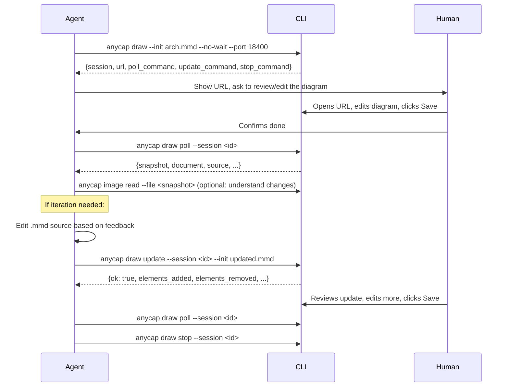

# Draw

Interactive browser-based whiteboard powered by Excalidraw. Opens a visual editor where humans can draw diagrams, add shapes, write text, and collaborate in real-time. Supports blank canvas, Mermaid diagram conversion (auto-converted to editable shapes), and Excalidraw JSON import.

Use draw when you need to create or iterate on diagrams, architecture charts, flowcharts, wireframes, or any visual content collaboratively with a human. The agent can push structural updates via `anycap draw update` without restarting the session. Updates replace all diagram elements with fresh Mermaid conversion output while preserving user-drawn annotations.

## Input Formats

| Format | Auto-detected by | What happens |
|--------|-------------------|-------------|
| Mermaid | `.mmd`, `.mermaid` extension | Parsed and converted to editable Excalidraw shapes |
| Excalidraw | `.excalidraw`, `.excalidraw.json` extension | Loaded directly into the editor |
| Image | `.png`, `.jpg`, `.svg`, etc. | Set as background image on the canvas |
| Blank | No `--init` flag | Empty canvas |

## Multi-User Collaboration

Multiple users can open the same draw URL simultaneously. All changes sync in real-time via WebSocket. This is useful for collaborative diagramming sessions:

```bash
# Start on a LAN/public server so teammates can join
anycap draw --init arch.mmd --no-wait --bind 0.0.0.0 --port 8888
```

Share `http://<server-ip>:8888` with your team.

## Two Modes

| Mode | Flag | Behavior |
|------|------|----------|
| Blocking | (default) | Opens browser, waits for user to click Save, outputs result, exits |
| Non-blocking | `--no-wait` | Starts background server, returns session info immediately |

**Recommended: use non-blocking mode (`--no-wait`) for agent workflows.** It allows the agent to push updates, poll for results, and manage the session lifecycle without blocking.

## Non-blocking Mode (Recommended Agent Workflow)



### Step 1: Start

```bash
anycap draw --init arch.mmd --no-wait --port 18400
```

Response:

```json
{
  "status": "started",
  "session": "drw_a1b2c3d4",
  "url": "http://127.0.0.1:18400",
  "poll_command": "anycap draw poll --session drw_a1b2c3d4",
  "update_command": "anycap draw update --session drw_a1b2c3d4 --init <file>",
  "stop_command": "anycap draw stop --session drw_a1b2c3d4",
  "session_file": ".anycap/draw/drw_a1b2c3d4.json",
  "expires_in": 1800,
  "next_action_hint": "..."
}
```

Show the URL to the human. The browser opens automatically on desktop. For headless/SSH environments, share the URL manually. Use a fixed `--port` for consistent sessions.

**Session recovery:** If you lose the session ID, use `anycap draw list` to see all active sessions with recovery commands.

### Step 2: Poll

After the human confirms they clicked Save:

```bash
anycap draw poll --session drw_a1b2c3d4
```

| Status | Meaning |
|--------|---------|
| `"status": "submitted"` | User saved -- snapshot and document available |
| `"status": "pending"` | User has not clicked Save yet |
| `"status": "expired"` | Session timed out (30 minutes) |

### Step 3: Update (Optional -- Iterative Workflow)

Push new Mermaid or Excalidraw content to the active session. The browser validates the content before applying.

**Merge behavior:** Update replaces ALL diagram elements (Mermaid-converted shapes) with fresh conversion output, shifted to the same canvas area. User-drawn annotations (freehand drawings, sticky notes, text labels added by the human) are preserved. However, any repositioning the user did on diagram elements will be reset -- the agent owns diagram structure, the user owns annotations.

This means: if the user moved a node to a different position, that position will be lost on the next update. To incorporate user layout preferences, read the snapshot (`anycap image read`), understand their intent, and encode the desired layout in the Mermaid source itself.

```bash
anycap draw update --session drw_a1b2c3d4 --init updated-arch.mmd
```

Response:

```json
{
  "ok": true,
  "elements_added": 12,
  "elements_removed": 3,
  "elements_merged": 5
}
```

If validation fails (e.g., invalid Mermaid syntax), the response includes `"ok": false` with an error message. The canvas is not modified on failure.

### Step 4: Stop

Clean up the background server:

```bash
anycap draw stop --session drw_a1b2c3d4
```

## Blocking Mode

For simple one-shot interactions where the agent does not need to push updates:

```bash
anycap draw --init arch.mmd
anycap draw --init existing.excalidraw
anycap draw --image mockup.png
anycap draw
```

The command blocks until the user clicks Save, then outputs the result and exits.

## Flags

| Flag | Required | Description |
|------|----------|-------------|
| `--init` | no | Initial content file (`.mmd`, `.excalidraw`, `.json`) |
| `--image` | no | Background image file |
| `-o, --output` | no | Output directory for saved artifacts (default: `.anycap/draw/`) |
| `--no-wait` | no | Start background server and return immediately |
| `--bind` | no | Bind address (default: `127.0.0.1`; use `0.0.0.0` for LAN/remote) |
| `--port` | no | Server port (default: random; agents should specify a fixed port) |

## Output Format

The draw result (from both blocking mode stdout and poll response):

```json
{
  "status": "submitted",
  "snapshot": ".anycap/draw/drw_xxx_snapshot.png",
  "document": ".anycap/draw/drw_xxx.excalidraw",
  "source": "/path/to/original.mmd",
  "hint": "User modified the whiteboard. Use 'anycap image read' on the snapshot to understand the current state. To iterate: edit the .mmd source and push via 'anycap draw update'. Update replaces all diagram elements with the new conversion (user-drawn annotations are preserved, but diagram element positions are reset). Alternatively, re-open the .excalidraw file with 'anycap draw --init' to start from the current visual state."
}
```

| Field | Description |
|-------|-------------|
| `snapshot` | PNG image of the final canvas state |
| `document` | Excalidraw JSON file (can be re-opened with `--init`) |
| `source` | Original Mermaid source file (only if input was `.mmd`) |
| `hint` | Suggested next actions for the agent |

## Typical Agent Workflow: Diagram Iteration

1. Agent generates a Mermaid diagram from code/requirements
2. `anycap draw --init diagram.mmd --no-wait --port 18400` -- show to human
3. Human edits the diagram, clicks Save
4. `anycap draw poll --session drw_xxx` -- get the snapshot
5. `anycap image read --file <snapshot>` -- understand what changed
6. Agent updates the `.mmd` source based on feedback
7. `anycap draw update --session drw_xxx --init updated.mmd` -- push changes
8. Repeat 3-7 until the human is satisfied
9. `anycap draw stop --session drw_xxx` -- clean up

## Subcommands

### `draw poll`

Poll for the latest draw result after the user clicks Save.

```bash
anycap draw poll --session <session_id>
```

### `draw update`

Push updated content to an active session via WebSocket. Validates before applying.

```bash
anycap draw update --session <session_id> --init <file>
```

### `draw stop`

Stop the background server and clean up the session.

```bash
anycap draw stop --session <session_id>
```

### `draw list`

List all draw sessions in the current directory with status and recovery commands.

```bash
anycap draw list
```
