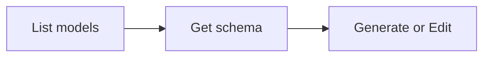

# Image Generation and Editing

Generate images from text prompts or edit existing images. Models support different **operations** -- each operation is a distinct CLI subcommand:

| Operation | Command | Description |
|-----------|---------|-------------|
| `generate` | `anycap image generate` | Create images from text or transform with reference images |
| `edit` | `anycap image edit` | Edit existing images using text prompts |

Which operations a model supports is defined in the model catalog. Use `image models` to discover available operations per model.

## Workflow



### Step 1: Discover models

```bash
anycap image models
```

Extract model IDs:

```bash
anycap image models | jq -r '.models[].model'
```

To inspect a specific model and its operations:

```bash
anycap image models <model-id>
```

Models support different **operations** and **modes**:

```bash
# List operations and modes for a model
anycap image models <model-id> | jq -r '.model.operations[] | "\(.operation): \(.modes[].mode)"'
```

| Mode | Description |
|------|-------------|
| `text-to-image` | Generate image from text prompt |
| `image-to-image` | Edit or transform a reference image |

### Step 2: Check parameter schema (important)

Each model, operation, and mode accepts different parameters. Always fetch the schema before calling:

```bash
# All schemas for a model (all operations and modes)
anycap image models <model-id> schema

# Filter by operation
anycap image models <model-id> schema --operation edit

# Filter by mode
anycap image models <model-id> schema --mode text-to-image

# Filter by both
anycap image models <model-id> schema --operation generate --mode text-to-image
```

The schema response returns an array of schemas, each tagged with its operation and mode:

```json
{
  "schemas": [
    {
      "operation": "generate",
      "mode": "text-to-image",
      "schema": {
        "model_params": {
          "prompt": {"type": "string", "required": true},
          "aspect_ratio": {"type": "string", "enum": ["1:1", "16:9", "9:16"]},
          "resolution": {"type": "string", "enum": ["2k", "4k"]}
        }
      }
    }
  ]
}
```

List parameter names and types for a specific operation+mode:

```bash
anycap image models <model-id> schema --operation edit --mode image-to-image \
  | jq -r '.schemas[0].schema.model_params | to_entries[] | "\(.key): \(.value.type)"'
```

### Step 3: Generate or Edit

Both commands auto-download the result to the current directory. Use `-o` for a custom path.

**Best practice:** Always use `-o` with a descriptive filename derived from the prompt context (e.g., `-o coffee-shop-logo.png`). Without `-o`, the file gets a generic timestamped name.

#### Image Generate

Create images from text, or transform with reference images:

```bash
# Basic text-to-image (mode inferred)
anycap image generate --prompt "a paper crane on a wooden table" --model <model-id>

# With parameters from schema
anycap image generate \
  --prompt "a mountain landscape at sunset" \
  --model <model-id> \
  --param aspect_ratio=16:9

# Image-to-image with local file (auto-uploaded)
anycap image generate \
  --prompt "make it look like a watercolor painting" \
  --model nano-banana-2 \
  --mode image-to-image \
  --param images=/path/to/photo.png

# Image-to-image with remote URL
anycap image generate \
  --prompt "add a sunset background" \
  --model nano-banana-2 \
  --mode image-to-image \
  --param images=https://example.com/photo.jpg
```

#### Image Edit

Edit existing images using text prompts. Edit models (e.g., seedream-5) specialize in structural preservation during edits:

```bash
# Edit with local file (auto-uploaded)
anycap image edit \
  --prompt "remove the background" \
  --model seedream-5 \
  --param images=/path/to/photo.png

# Edit with remote URL
anycap image edit \
  --prompt "change hair color to red" \
  --model seedream-5 \
  --param images=https://example.com/portrait.jpg \
  -o edited.png
```

### Flags (shared by generate and edit)

| Flag | Required | Description |
|------|----------|-------------|
| `--prompt` | yes | Text description of what to generate or how to edit |
| `--model` | yes | Model ID from `image models` |
| `--mode` | no | Mode (e.g. `text-to-image`, `image-to-image`). Inferred if omitted |
| `--param` | no | Parameter as `key=value` (repeatable); discover via `image models <model> schema` |
| `-o, --output` | no | Custom output path (default: current directory) |

### --param value types

Values are auto-parsed as JSON when possible:

| Example | Parsed as |
|---------|-----------|
| `--param aspect_ratio=16:9` | string `"16:9"` |
| `--param duration=5` | number `5` |
| `--param hd=true` | boolean `true` |
| `--param negative_prompt="blurry"` | string `"blurry"` |
| `--param images='["url1","url2"]'` | array `["url1","url2"]` |
| `--param images=/path/to/file.png` | local file (auto-uploaded, wrapped to array) |

File-or-url parameters (like `images`) accept local file paths or HTTP URLs. Local files are auto-uploaded. If a local path does not exist, the CLI returns an error.

### Output Format

The output is a flat JSON object optimized for agent consumption:

```json
{"status":"success","local_path":"/absolute/path/to/img.png","model":"seedream-5","credits_used":1,"request_id":"req_abc123"}
```

| Field | Description |
|-------|-------------|
| `status` | `"success"` or `"error"` |
| `local_path` | Absolute path to the downloaded image file |
| `model` | Model ID used |
| `credits_used` | Number of credits consumed |
| `request_id` | Server request ID for debugging |

Extract the local file path:

```bash
anycap image generate --prompt "..." --model <model-id> | jq -r '.local_path'
```

## Complete Example

```bash
# Find models and their operations
anycap image models
anycap image models seedream-5 | jq '.model.operations[] | {operation, modes: [.modes[].mode]}'

# --- Generate ---

# Check text-to-image parameters
anycap image models nano-banana-2 schema --operation generate --mode text-to-image

# Generate text-to-image
anycap image generate \
  --prompt "a watercolor painting of a Japanese garden" \
  --model nano-banana-2 \
  --param aspect_ratio=16:9 \
  -o garden.png

# --- Edit ---

# Check edit parameters
anycap image models seedream-5 schema --operation edit

# Edit an image
anycap image edit \
  --prompt "make it look like an oil painting" \
  --model seedream-5 \
  --param images=./garden.png \
  -o garden-oil.png
```
