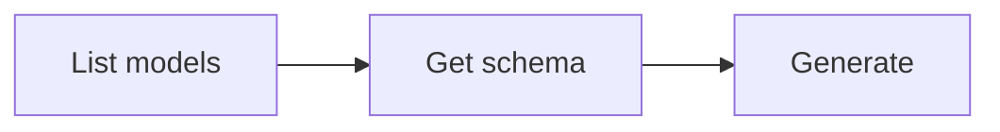

# Image Generation

Generate images from text prompts. The generated image is automatically downloaded to the current directory.

## Workflow



### Step 1: Discover models

```bash
anycap image models
```

Extract model IDs:

```bash
anycap image models | jq -r '.models[].model'
```

To inspect a specific model:

```bash
anycap image models <model-id>
```

### Step 2: Check parameter schema (important)

Each model accepts different parameters. Always fetch the schema before generating to discover available parameters:

```bash
anycap image models <model-id> schema
```

The schema response describes all accepted parameters with their types, defaults, and allowed values. Use this to construct valid `--param` flags.

List all parameter names and their types:

```bash
anycap image models <model-id> schema | jq -r '.data.schema.model_params | to_entries[] | "\(.key): \(.value.type)"'
```

### Step 3: Generate

The generated image is automatically saved to the current directory. Use `-o` to specify a custom path.

**Best practice:** Always use `-o` with a descriptive filename derived from the prompt context (e.g., `-o coffee-shop-logo.png`). Without `-o`, the file gets a generic timestamped name like `image_20260326_175540.png`.

Basic generation:

```bash
anycap image generate --prompt "a paper crane on a wooden table" --model <model-id>
```

With parameters discovered from the schema:

```bash
anycap image generate \
  --prompt "a mountain landscape at sunset" \
  --model <model-id> \
  --param aspect_ratio=16:9 \
  --param negative_prompt="blurry, watermark"
```

With a reference image (for editing operations):

```bash
anycap image generate \
  --prompt "make it look like a watercolor painting" \
  --model <model-id> \
  --param reference_image_urls='["https://example.com/photo.jpg"]'
```

Save to a specific path:

```bash
anycap image generate \
  --prompt "a logo for a coffee shop" \
  --model <model-id> \
  -o logo.png
```

### Flags

| Flag           | Required | Description                                                                       |
| -------------- | -------- | --------------------------------------------------------------------------------- |
| `--prompt`     | yes      | Text description of the image to generate                                         |
| `--model`      | yes      | Model ID from `image models`                                                      |
| `--param`      | no       | Parameter as `key=value` (repeatable); discover via `image models <model> schema` |
| `-o, --output` | no       | Custom output path (default: current directory)                                   |

### --param value types

Values are auto-parsed as JSON when possible:

| Example                                          | Parsed as               |
| ------------------------------------------------ | ----------------------- |
| `--param aspect_ratio=16:9`                      | string `"16:9"`         |
| `--param duration=5`                             | number `5`              |
| `--param hd=true`                                | boolean `true`          |
| `--param negative_prompt="blurry"`               | string `"blurry"`       |
| `--param reference_image_urls='["url1","url2"]'` | array `["url1","url2"]` |

### Output Format

The output is a flat JSON object optimized for agent consumption:

```json
{"status":"success","local_path":"/absolute/path/to/img.png","model":"nano-banana-2","credits_used":1,"request_id":"req_abc123"}
```

| Field          | Description                                |
| -------------- | ------------------------------------------ |
| `status`       | `"success"` or `"error"`                   |
| `local_path`   | Absolute path to the downloaded image file |
| `model`        | Model ID used for generation               |
| `credits_used` | Number of credits consumed                 |
| `request_id`   | Server request ID for debugging            |

Extract the local file path:

```bash
anycap image generate --prompt "..." --model <model-id> | jq -r '.local_path'
```

## Complete Example

```bash
# Find a model
anycap image models

# Check what parameters it accepts
anycap image models flux-schnell schema

# Generate with parameters from the schema
anycap image generate \
  --prompt "a watercolor painting of a Japanese garden" \
  --model flux-schnell \
  --param aspect_ratio=16:9 \
  -o garden.png
```
