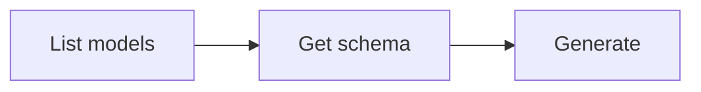

# Image Generation

Generate images from text prompts or transform existing images. The `generate` operation supports different **modes** for different input/output modalities:

| Mode | Description |
|------|-------------|
| `text-to-image` | Generate image from text prompt (default) |
| `image-to-image` | Transform or edit a reference image |

When a model supports only one mode, it is inferred automatically. Use `--mode` to explicitly select a mode when the model supports multiple.

## Workflow



### Step 1: Discover models

```bash
anycap image models
```

Extract model IDs:

```bash
anycap image models | jq -r '.models[].model'
```

To inspect a specific model and its modes:

```bash
anycap image models <model-id>
```

List operations and modes for a model:

```bash
anycap image models <model-id> | jq -r '.model.operations[] | "\(.operation): \(.modes[].mode)"'
```

### Step 2: Check parameter schema (important)

Each model and mode accepts different parameters. Always fetch the schema before calling:

```bash
# All schemas for a model (all modes)
anycap image models <model-id> schema

# Filter by mode
anycap image models <model-id> schema --mode text-to-image

# Filter by operation and mode
anycap image models <model-id> schema --operation generate --mode image-to-image
```

The schema response returns an array of schemas, each tagged with its operation and mode:

```json
{
  "schemas": [
    {
      "operation": "generate",
      "mode": "text-to-image",
      "schema": {
        "model_params": {
          "prompt": {"type": "string", "required": true},
          "aspect_ratio": {"type": "string", "enum": ["1:1", "16:9", "9:16"]},
          "resolution": {"type": "string", "enum": ["2k", "4k"]}
        }
      }
    }
  ]
}
```

List parameter names and types for a specific mode:

```bash
anycap image models <model-id> schema --mode image-to-image \
  | jq -r '.schemas[0].schema.model_params | to_entries[] | "\(.key): \(.value.type)"'
```

### Step 3: Generate

The command auto-downloads the result to the current directory. Use `-o` for a custom path.

**Best practice:** Always use `-o` with a descriptive filename derived from the prompt context (e.g., `-o hero-banner.png`). Without `-o`, the file gets a generic timestamped name.

#### Text-to-Image (default mode)

Create images from text prompts:

```bash
# Basic text-to-image (mode inferred)
anycap image generate --prompt "a paper crane on a wooden table" --model nano-banana-2

# With parameters from schema
anycap image generate \
  --prompt "a mountain landscape at sunset" \
  --model nano-banana-2 \
  --param aspect_ratio=16:9 \
  -o landscape.png
```

#### Image-to-Image (edit/transform mode)

Transform or edit an existing image using a text prompt. Pass the reference image via `--param images=`:

```bash
# Edit with local file (auto-uploaded)
anycap image generate \
  --prompt "make it look like a watercolor painting" \
  --model nano-banana-2 \
  --mode image-to-image \
  --param images=./photo.png \
  -o photo-watercolor.png

# Edit with remote URL
anycap image generate \
  --prompt "remove the background" \
  --model nano-banana-2 \
  --mode image-to-image \
  --param images=https://example.com/photo.jpg \
  -o no-bg.png

# Use with annotated image for precise edits
anycap image generate \
  --prompt "#1: Replace the desk with a standing desk. #2: Add a cat. Keep all other elements unchanged." \
  --model nano-banana-2 \
  --mode image-to-image \
  --param images=./workspace-annotated.png \
  -o workspace-v2.png
```

#### Multiple Reference Images

Some models accept multiple reference images for style transfer, composition blending, or subject-driven generation. Pass an array of paths or URLs via JSON array syntax:

```bash
# Multiple local files (each auto-uploaded)
anycap image generate \
  --prompt "combine the architecture style of the first image with the color palette of the second" \
  --model nano-banana-2 \
  --mode image-to-image \
  --param images='["./style-ref.png","./color-ref.png"]' \
  -o blended.png

# Mix of local files and URLs
anycap image generate \
  --prompt "a portrait in the style of the reference images" \
  --model nano-banana-2 \
  --mode image-to-image \
  --param images='["./local-ref.png","https://example.com/style-ref.jpg"]' \
  -o portrait-styled.png
```

Key points:
- Use JSON array syntax `'["path1","path2"]'` -- repeating `--param images=` overwrites rather than appends.
- Local file paths inside the array are auto-uploaded, same as single-file mode.
- Not all models support multiple references. Check the model schema (`image models <model> schema --mode image-to-image`) to see if the `images` parameter accepts multiple items.
- When a model does not support multiple images, it typically uses only the first image and ignores the rest.

### Flags

| Flag | Required | Description |
|------|----------|-------------|
| `--prompt` | yes | Text description of what to generate or how to edit |
| `--model` | yes | Model ID from `image models` |
| `--mode` | no | Mode (e.g. `text-to-image`, `image-to-image`). Inferred if omitted |
| `--param` | no | Parameter as `key=value` (repeatable); discover via `image models <model> schema` |
| `-o, --output` | no | Custom output path (default: current directory) |

### --param value types

Values are auto-parsed as JSON when possible:

| Example | Parsed as |
|---------|-----------|
| `--param aspect_ratio=16:9` | string `"16:9"` |
| `--param duration=5` | number `5` |
| `--param hd=true` | boolean `true` |
| `--param negative_prompt="blurry"` | string `"blurry"` |
| `--param images='["url1","url2"]'` | array `["url1","url2"]` |
| `--param images=/path/to/file.png` | local file (auto-uploaded, wrapped to array) |

File-or-url parameters (like `images`) accept local file paths or HTTP URLs. Local files are auto-uploaded. If a local path does not exist, the CLI returns an error.

### Output Format

The output is a flat JSON object optimized for agent consumption:

```json
{"status":"success","local_path":"/absolute/path/to/img.png","model":"nano-banana-2","credits_used":1,"request_id":"req_abc123"}
```

| Field | Description |
|-------|-------------|
| `status` | `"success"` or `"error"` |
| `local_path` | Absolute path to the downloaded image file |
| `model` | Model ID used |
| `credits_used` | Number of credits consumed |
| `request_id` | Server request ID for debugging |

Extract the local file path:

```bash
anycap image generate --prompt "..." --model <model-id> | jq -r '.local_path'
```

## Complete Example

```bash
# Find models and their modes
anycap image models
anycap image models nano-banana-2 | jq '.model.operations[] | {operation, modes: [.modes[].mode]}'

# Check text-to-image parameters
anycap image models nano-banana-2 schema --mode text-to-image

# Generate text-to-image
anycap image generate \
  --prompt "a watercolor painting of a Japanese garden" \
  --model nano-banana-2 \
  --param aspect_ratio=16:9 \
  -o garden.png

# Check image-to-image parameters
anycap image models nano-banana-2 schema --mode image-to-image

# Transform an image (image-to-image)
anycap image generate \
  --prompt "make it look like an oil painting" \
  --model nano-banana-2 \
  --mode image-to-image \
  --param images=./garden.png \
  -o garden-oil.png
```
