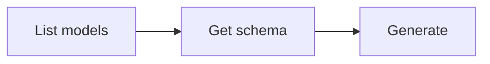

# Video Generation

Generate videos from text prompts or animate reference images. The generated video is automatically downloaded to the current directory.

## Workflow



### Step 1: Discover models

```bash
anycap video models
```

Extract model IDs:

```bash
anycap video models | jq -r '.models[].model'
```

To inspect a specific model:

```bash
anycap video models <model-id>
```

Models support different **modes** -- each mode represents a distinct input/output modality:

| Mode             | Description                          |
| ---------------- | ------------------------------------ |
| `text-to-video`  | Generate video from text prompt      |
| `image-to-video` | Animate a reference image into video |

Not all models support all modes. List modes for a model:

```bash
anycap video models <model-id> | jq -r '.model.operations[].modes[].mode'
```

### Step 2: Check parameter schema (important)

Each model and mode accepts different parameters. Always fetch the schema before generating to discover available parameters:

```bash
# All schemas for a model (all operations and modes)
anycap video models <model-id> schema

# Filter by mode
anycap video models <model-id> schema --mode text-to-video
anycap video models <model-id> schema --mode image-to-video

# Filter by operation and mode
anycap video models <model-id> schema --operation generate --mode text-to-video
```

The schema response returns an array of schemas, each tagged with its operation and mode:

```json
{
  "schemas": [
    {
      "operation": "generate",
      "mode": "text-to-video",
      "schema": {
        "model_params": {
          "prompt": {"type": "string", "required": true},
          "aspect_ratio": {"type": "string", "enum": ["16:9", "9:16", "1:1"]},
          "duration": {"type": "integer", "enum": [4, 5, 6, 7, 8]},
          "resolution": {"type": "string", "enum": ["720p", "1080p"]}
        }
      }
    }
  ]
}
```

List parameter names and types for a specific mode:

```bash
anycap video models <model-id> schema --mode text-to-video \
  | jq -r '.schemas[0].schema.model_params | to_entries[] | "\(.key): \(.value.type)"'
```

### Step 3: Generate

The generated video is automatically saved to the current directory. Use `-o` to specify a custom path.

**Best practice:** Always use `-o` with a descriptive filename derived from the prompt context (e.g., `-o ocean-waves.mp4`). Without `-o`, the file gets a generic timestamped name like `video_20260327_103000.mp4`.

Basic text-to-video generation (mode is inferred):

```bash
anycap video generate --prompt "a cat walking on the beach at sunset" --model <model-id>
```

With parameters discovered from the schema:

```bash
anycap video generate \
  --prompt "ocean waves crashing on rocks" \
  --model <model-id> \
  --param aspect_ratio=16:9 \
  --param duration=5
```

Image-to-video with explicit mode (local file -- auto-uploaded):

```bash
anycap video generate \
  --prompt "animate this scene with gentle wind" \
  --model seedance-1.5-pro \
  --mode image-to-video \
  --param images=/path/to/photo.png
```

Image-to-video with a remote URL:

```bash
anycap video generate \
  --prompt "animate this scene with gentle wind" \
  --model seedance-1.5-pro \
  --mode image-to-video \
  --param images=https://example.com/photo.jpg
```

Save to a specific path:

```bash
anycap video generate \
  --prompt "a logo animation" \
  --model <model-id> \
  -o logo-animation.mp4
```

### Flags

| Flag           | Required | Description                                                                       |
| -------------- | -------- | --------------------------------------------------------------------------------- |
| `--prompt`     | yes      | Text description of the video to generate                                         |
| `--model`      | yes      | Model ID from `video models`                                                      |
| `--mode`       | no       | Generation mode (e.g. `text-to-video`, `image-to-video`). Inferred if omitted     |
| `--param`      | no       | Parameter as `key=value` (repeatable); discover via `video models <model> schema` |
| `-o, --output` | no       | Custom output path (default: current directory)                                   |

### --param value types

Values are auto-parsed as JSON when possible:

| Example                            | Parsed as                                    |
| ---------------------------------- | -------------------------------------------- |
| `--param aspect_ratio=16:9`        | string `"16:9"`                              |
| `--param duration=5`               | number `5`                                   |
| `--param resolution=1080p`         | string `"1080p"`                             |
| `--param images='["url1"]'`        | array `["url1"]`                             |
| `--param images=/path/to/file.png` | local file (auto-uploaded, wrapped to array) |

### Output Format

The output is a flat JSON object optimized for agent consumption:

```json
{"status":"success","local_path":"/absolute/path/to/video.mp4","model":"veo-3.1","credits_used":5,"request_id":"req_abc123"}
```

| Field          | Description                                |
| -------------- | ------------------------------------------ |
| `status`       | `"success"` or `"error"`                   |
| `local_path`   | Absolute path to the downloaded video file |
| `model`        | Model ID used for generation               |
| `credits_used` | Number of credits consumed                 |
| `request_id`   | Server request ID for debugging            |

Extract the local file path:

```bash
anycap video generate --prompt "..." --model <model-id> | jq -r '.local_path'
```

## Complete Example

```bash
# Find available models
anycap video models

# Check what modes seedance-1.5-pro supports
anycap video models seedance-1.5-pro | jq '.model.operations[].modes[].mode'
# -> "text-to-video", "image-to-video"

# Check text-to-video parameters
anycap video models seedance-1.5-pro schema --mode text-to-video

# Generate text-to-video
anycap video generate \
  --prompt "a watercolor animation of cherry blossoms falling" \
  --model seedance-1.5-pro \
  --param aspect_ratio=16:9 \
  --param duration=5 \
  -o cherry-blossoms.mp4

# Check image-to-video parameters
anycap video models seedance-1.5-pro schema --mode image-to-video

# Generate image-to-video (local file)
anycap video generate \
  --prompt "animate this landscape with clouds moving" \
  --model seedance-1.5-pro \
  --mode image-to-video \
  --param images=./landscape.jpg \
  --param duration=8 \
  -o animated-landscape.mp4
```
