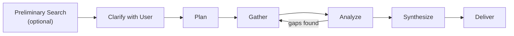

# AnyCap Deep Research

> **Read this entire file before starting.** It defines the multi-source research workflow from planning through synthesis.

Conduct thorough, multi-source research on any topic. Gather information broadly, verify claims rigorously, and synthesize findings into a polished, well-sourced report.

**Think deeply. Search broadly. Verify everything. Deliver clearly.**

## Before You Start

**Read all five reference files before taking any action.** Understanding the full process prevents wasted effort and ensures thorough research.

1. Read this file (SKILL.md) for the overview and principles
2. Read each reference in order:
   - [01-plan.md](references/01-plan.md)
   - [02-gather.md](references/02-gather.md)
   - [03-analyze.md](references/03-analyze.md)
   - [04-synthesize.md](references/04-synthesize.md)
   - [05-deliver.md](references/05-deliver.md)
3. Then begin Phase 1: Plan

For detailed CLI command usage (flags, output formats, jq patterns), refer to the **anycap-cli** skill and its references.

## Prerequisites

- `anycap` CLI installed and authenticated (`anycap status` to verify)
- A local working directory for intermediate files

## When to Use This Skill

- Deep research, research report, deep dive on any topic
- Competitive analysis, market research, technology comparison
- Literature review or state-of-the-art survey
- Investigative research requiring cross-referencing multiple sources
- Any task where a single search is insufficient

## Research Process

Follow the research process below. User clarification is **mandatory** -- do not skip it.

The process starts with an optional preliminary search to build context, followed by a **mandatory** clarification with the user, then autonomous execution.

Each phase has detailed guidance in the references:

1. **[Plan](references/01-plan.md)** -- Preliminary search (optional), clarify with user (mandatory), design search strategy, set up workspace
2. **[Gather](references/02-gather.md)** -- Execute searches, crawl pages, download and save all raw material
3. **[Analyze](references/03-analyze.md)** -- Cross-verify claims, assess source quality, identify gaps
4. **[Synthesize](references/04-synthesize.md)** -- Write the report with proper sourcing and illustrations
5. **[Deliver](references/05-deliver.md)** -- Save to Drive, publish as web page, or both

## Human-in-the-Loop

This skill involves the user at key decision points:

1. **Before research begins** -- Clarify the research question, confirm sub-questions, agree on delivery format, and ask whether image generation is permitted. See [01-plan.md](references/01-plan.md).
2. **During synthesis** -- Review all downloaded and generated images yourself (via `anycap actions image-read`) before including them in the report. See [04-synthesize.md](references/04-synthesize.md).

Do not skip the initial clarification. A 2-minute conversation with the user can save an hour of misguided research.

**Once research begins (Phase 2 onward), work autonomously.** Do not interrupt the user with questions during gathering, analysis, or synthesis. Make your best judgment based on the preferences established in Phase 1. If you encounter ambiguity, note it in your research journal and resolve it with the best available evidence.

## Core Principles

**Be thorough, not frugal.** Use as many searches and crawls as needed to produce a comprehensive report. Breadth and depth of research determine report quality.

**Save everything.** Write intermediate results (search outputs, crawled pages, grounding responses, notes) to local files. These are your evidence base for cross-verification and sourcing.

**Verify, do not assume.** Cross-check important claims across multiple independent sources. When sources conflict, investigate further rather than picking one.

**Search in parallel.** When sub-questions are independent, run multiple searches concurrently rather than sequentially. This produces results faster and gives you more material to cross-reference.

**Prefer AI Grounded search for complex questions.** Grounding search (`--prompt`) synthesizes across multiple sources and provides citations. Use it generously for questions that benefit from multi-source synthesis. Use general search (`--query`) for finding specific pages and data points.

**Use mermaid for diagrams.** When the report needs architecture diagrams, flow charts, timelines, or comparisons, use mermaid syntax in markdown. Both Drive and Page render mermaid natively. Always verify mermaid diagrams render correctly before including them in the final report (see [04-synthesize.md](references/04-synthesize.md)).

**Prefer original images.** When a source provides relevant images, diagrams, or screenshots, download and use the originals. Only generate images when you need to explain a concept, aggregate data into a visualization, or express information more clearly than the source material. Generated images must not misrepresent or deviate from the source material.

## Quick Reference

| Tool | Purpose |
|------|---------|
| `anycap search --query "..."` | Find pages on a topic |
| `anycap search --query "..." --no-crawl` | Fast scan: titles and URLs only |
| `anycap search --prompt "..."` | AI Grounded answer with citations |
| `anycap crawl <url>` | Read a web page as Markdown |
| `anycap image generate ...` | Create explanatory illustrations |
| `anycap drive upload ...` | Store files in the cloud |
| `anycap drive share ...` | Generate a shareable link |
| `anycap page deploy ...` | Publish as a web page |
