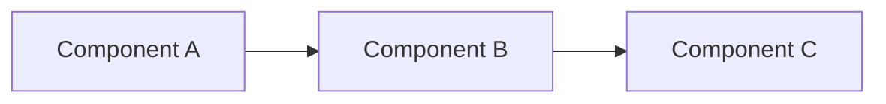

# Phase 4: Synthesize

Write the report from your verified findings. This is where raw research becomes a coherent narrative.

## Report Structure

```markdown
# [Research Topic]

> Research conducted on [date]. Sources verified as of this date.

## Executive Summary

[2-3 paragraphs: what was researched, key findings, main conclusions]

## Background

[Context the reader needs to understand the topic]

## Findings

### [Sub-topic 1]

[Analysis with inline source references]

### [Sub-topic 2]

[Analysis with inline source references]

...

## Analysis

[Cross-cutting insights, comparisons, patterns across sub-topics]

## Limitations

[What this research does not cover, unresolved questions, data gaps]

## Conclusions

[Key takeaways and recommendations]

## Sources

1. [Title](URL) -- [what this source contributed to the report]
2. [Title](URL) -- [what this source contributed]
...
```

## Writing Guidelines

**Source everything.** Every major claim should reference a numbered source from the Sources section. Use inline references like [1], [2, 3] when citing.

**Present multiple perspectives.** When sources disagree and the conflict could not be resolved, present both views and explain the disagreement. Do not silently pick a side.

**Distinguish facts from analysis.** Make it clear what is reported fact ("Source X states...") versus your interpretation ("This suggests that...").

**Use tables and lists for comparisons.** Structured data is easier to scan than prose. Use tables for feature comparisons, timelines, or multi-source data.

**Include specific data.** Numbers, dates, version numbers, quotes -- specifics make a report credible. Vague claims ("many companies use X") are weak; specific claims ("as of 2026, Cloudflare Workers, Fastly Compute, and Vercel Edge Functions support WASM runtimes [3, 5]") are strong.

## Illustrations

### Use Mermaid for Diagrams

When the report needs architecture diagrams, flow charts, timelines, sequence diagrams, or comparison structures, use mermaid syntax in markdown code blocks:

````markdown

````

Both Drive and Page render mermaid natively. Prefer mermaid over ASCII art -- it produces clean, readable diagrams.

Good uses for mermaid:
- Architecture and system diagrams
- Process flows and decision trees
- Timelines and sequence diagrams
- Comparison matrices (use tables for simple ones, mermaid for complex relationships)

When delivering via Drive, mermaid diagrams in markdown render automatically. You can also create standalone diagram files and share them:

```bash
# Create a standalone mermaid diagram as markdown
echo '```mermaid
graph TB
    A[System A] --> B[System B]
```' > research-topic/assets/architecture.md

# Upload to Drive for shareable rendering
anycap drive upload research-topic/assets/architecture.md --parent-path /research
anycap drive share --src-path /research/architecture.md
```

### Prefer Original Images

When a source provides a diagram, chart, screenshot, or photo that explains a concept, use the original. Download it during the Gather phase and reference it in the report:

```markdown

*Source: [Official Docs](https://example.com/docs) [3]*
```

Always attribute the source when using original images.

### Review Every Image Before Including It

Before adding any image (downloaded or generated) to the report, review it yourself using image understanding:

```bash
# Check a downloaded image for relevance and readability
anycap actions image-read --file research-topic/assets/architecture-diagram.png \
  --instruction "Describe what this diagram shows. Is it clear and relevant to [topic]?"

# Verify a generated illustration is accurate
anycap actions image-read --file research-topic/assets/comparison-chart.png \
  --instruction "Does this chart accurately represent [the data I intended]?"
```

Do not include images you have not reviewed. A blurry screenshot, an irrelevant diagram, or an inaccurate generated chart damages the report's credibility.

### When to Generate Images

Generate images only when:

- **Aggregating information** -- combining data from multiple sources into a single comparison chart or timeline that does not exist in any source
- **Explaining a concept** -- creating a diagram to clarify a complex idea that no source illustrates well
- **Improving expression** -- a visual would communicate the finding more effectively than text alone

Generated images must faithfully represent the underlying data and analysis. Do not generate images that embellish, exaggerate, or misrepresent the source material.

```bash
# Generate an explanatory diagram
anycap image generate \
  --prompt "clean comparison diagram showing [concept based on verified data]" \
  --model seedream-5 -o research-topic/assets/comparison-diagram.png
```

### Sharing Images in Reports

For reports delivered via Drive or Page, upload images and get share links:

```bash
anycap drive upload research-topic/assets/comparison-diagram.png --parent-path /research
SHARE_URL=$(anycap drive share --src-path /research/comparison-diagram.png | jq -r '.share_url')
# Use in markdown: 
```

For Page-hosted reports, include images in the deploy directory and reference them with relative paths.
