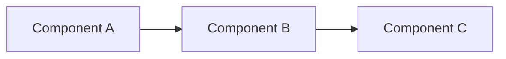

# Phase 4: Synthesize

Write the report from your verified findings. This is where raw research becomes a coherent narrative.

## Report Structure

```markdown
# [Research Topic]

> Research conducted on [date]. Sources verified as of this date.

## Executive Summary

[2-3 paragraphs: what was researched, key findings, main conclusions]

## Background

[Context the reader needs to understand the topic]

## Findings

### [Sub-topic 1]

[Analysis with inline source references]

### [Sub-topic 2]

[Analysis with inline source references]

...

## Analysis

[Cross-cutting insights, comparisons, patterns across sub-topics]

## Limitations

[What this research does not cover, unresolved questions, data gaps]

## Conclusions

[Key takeaways and recommendations]

## Sources

1. [Title](URL) -- what this source contributed to the report
2. [Title](URL) -- what this source contributed
...
```

For long reports, always include the Sources section -- it gives readers a consolidated bibliography to browse. When using footnote-style references in the body (e.g., `[[1]](URL)`), the Sources section maps each number to its full title and URL.

## Writing Guidelines

**Source everything with hyperlinks.** Every claim must be traceable to its source via a clickable link. Two styles are acceptable and can be mixed:

**Inline links** -- link the relevant phrase directly to the source:

> Cloudflare Workers uses [V8 isolates rather than traditional containers](https://blog.cloudflare.com/workers-architecture) for workload isolation.

**Footnote links** -- use numbered references with hyperlinks. Each footnote number in the body must be a clickable link to the source URL:

> Cloudflare Workers uses V8 isolates rather than traditional containers [[1]](https://blog.cloudflare.com/workers-architecture) for workload isolation.

For long reports, use footnotes with a Sources section at the end so readers can browse all references in one place. For shorter pieces, inline links are cleaner. Both styles can coexist in the same report.

**Never use plain-text footnote numbers** like `[1]` without a hyperlink -- every reference must be clickable where it appears.

**Present multiple perspectives.** When sources disagree and the conflict could not be resolved, present both views and explain the disagreement. Do not silently pick a side.

**Distinguish facts from analysis.** Make it clear what is reported fact ("Source X states...") versus your interpretation ("This suggests that...").

**Use tables and lists for comparisons.** Structured data is easier to scan than prose. Use tables for feature comparisons, timelines, or multi-source data.

**Include specific data.** Numbers, dates, version numbers, quotes -- specifics make a report credible. Vague claims ("many companies use X") are weak; specific claims ("as of 2026, [Cloudflare Workers](https://workers.cloudflare.com/), [Fastly Compute](https://www.fastly.com/products/edge-compute), and [Vercel Edge Functions](https://vercel.com/docs/functions/edge-functions) support WASM runtimes") are strong.

## Illustrations

### Use Mermaid for Diagrams

When the report needs architecture diagrams, flow charts, timelines, sequence diagrams, or comparison structures, use mermaid syntax in markdown code blocks:

````markdown

````

Both Drive and Page render mermaid natively. Prefer mermaid over ASCII art -- it produces clean, readable diagrams.

Good uses for mermaid:
- Architecture and system diagrams
- Process flows and decision trees
- Timelines and sequence diagrams
- Comparison matrices (use tables for simple ones, mermaid for complex relationships)

### Verify Mermaid Before Publishing

Mermaid diagrams can silently fail to render due to syntax errors, unsupported features, or edge cases in node labels. **Always verify mermaid diagrams render correctly before including them in the final report.**

Verification workflow:

1. Write your mermaid blocks in the report markdown.
2. Deploy a test page with just the report (or the mermaid blocks) to check rendering:

```bash
# Quick test deploy
anycap page deploy research-topic/report.md --new --name "mermaid-test" --publish
```

3. Open the page URL and visually confirm each diagram renders correctly.
4. Fix any syntax issues and redeploy until all diagrams look right.
5. Delete the test page after verification (or reuse the site for the final deploy).

Common mermaid pitfalls:
- Special characters in node labels (use quotes: `A["Label with (parens)"]`)
- Long labels that overflow (keep labels concise)
- Unsupported diagram types (stick to `graph`, `flowchart`, `sequenceDiagram`, `gantt`, `pie`, `mindmap`)
- Missing semicolons or arrows in sequence diagrams

### Prefer Original Images

When a source provides a diagram, chart, screenshot, or photo that explains a concept, use the original. Download it during the Gather phase and reference it in the report:

```markdown

*Source: [Official Docs](https://example.com/docs) [[3]](https://example.com/docs)*
```

Always attribute the source when using original images.

### Review Every Image Before Including It

Before adding any image (downloaded or generated) to the report, review it yourself using image understanding:

```bash
# Check a downloaded image for relevance and readability
anycap actions image-read --file research-topic/assets/architecture-diagram.png \
  --instruction "Describe what this diagram shows. Is it clear and relevant to [topic]?"

# Verify a generated illustration is accurate
anycap actions image-read --file research-topic/assets/comparison-chart.png \
  --instruction "Does this chart accurately represent [the data I intended]?"
```

Do not include images you have not reviewed. A blurry screenshot, an irrelevant diagram, or an inaccurate generated chart damages the report's credibility.

### When to Generate Images

Generate images only when:

- **Aggregating information** -- combining data from multiple sources into a single comparison chart or timeline that does not exist in any source
- **Explaining a concept** -- creating a diagram to clarify a complex idea that no source illustrates well
- **Improving expression** -- a visual would communicate the finding more effectively than text alone

Generated images must faithfully represent the underlying data and analysis. Do not generate images that embellish, exaggerate, or misrepresent the source material.

```bash
# Generate an explanatory diagram
anycap image generate \
  --prompt "clean comparison diagram showing [concept based on verified data]" \
  --model seedream-5 -o research-topic/assets/comparison-diagram.png
```

### Sharing Images in Reports

**For multi-file reports (markdown + images), use Page deployment with relative paths.** This is the most reliable approach -- all assets are served from the same site, no embedding issues.

Organize your report directory with images alongside the markdown:

```
research-topic/
  report.md              # references images as 
  assets/
    diagram.png
    comparison-chart.png
```

Deploy the entire directory:

```bash
anycap page deploy research-topic/ --new --name "Research: Topic" --publish
```

All relative image paths (`assets/diagram.png`) resolve correctly within the deployed site.

**Do not embed Drive share links as images inside Drive-shared markdown files.** Drive share links are standalone -- when one markdown file references another Drive share URL as an embedded image, the nested link may fail to load (especially with access controls). For single-file sharing (a PDF, a standalone image), Drive works fine. For anything with embedded images or multiple linked files, use Page.
