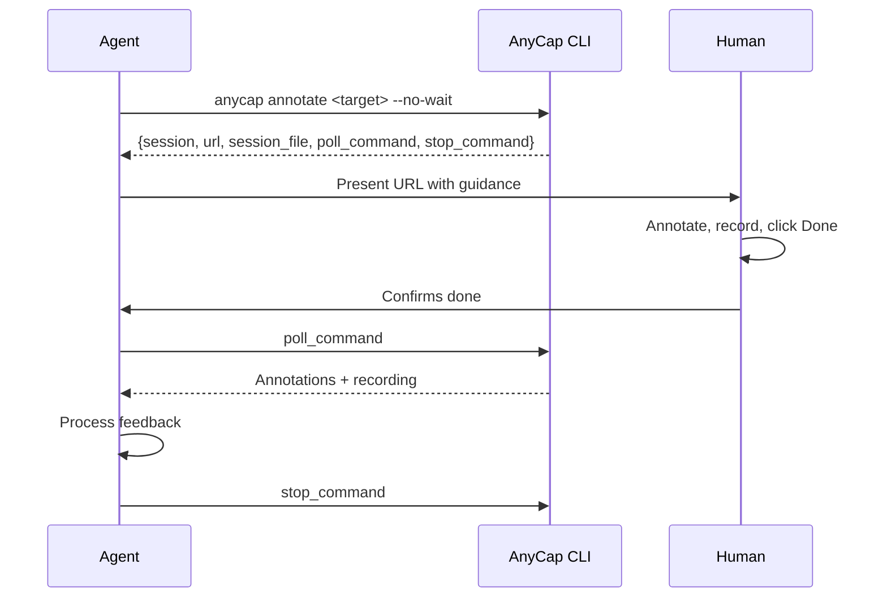
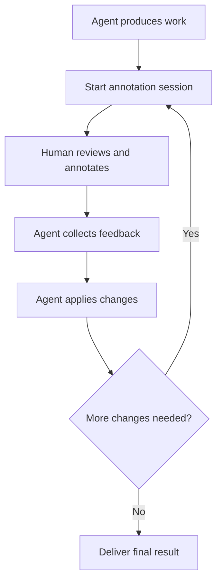

# AnyCap Human Interaction

> **Read this entire file before starting.** Skipping sections leads to incorrect workflows -- each media type has different capabilities and constraints.

Workflow guide for collecting structured visual feedback from humans using AnyCap's annotation tool. This skill teaches you **when and how** to involve humans in your workflow through visual annotation and screen recording.

For CLI command reference, read the `anycap-cli` skill. For media generation workflows, read the `anycap-media-production` skill.

## Prerequisites

AnyCap CLI must be installed and authenticated. Read the `anycap-cli` skill if setup is needed.

## Two Core Scenarios

AnyCap annotation excels at two distinct review workflows. Choose the one that fits your situation:

| Scenario | Best for | Primary artifact | Highlight |
|----------|----------|------------------|-----------|
| **URL / Web Page Review** | Web pages, local dev servers, live UIs | Screen recording with narration | Browse, annotate, and narrate -- the recording captures everything |
| **Image Collaborative Review** | Generated images, screenshots, designs | Annotated image with merged feedback | Multiple reviewers annotate simultaneously in real-time |

Both scenarios support all annotation tools (Rect, Arrow, Point, Freehand) and text labels. The difference is in what you get back and how the review is conducted.

## Command Quick Reference

```bash
# Blocking -- opens browser, waits for Done click, outputs result
anycap annotate <target> [-o output.png]

# Non-blocking -- starts background server, returns session info
anycap annotate <target> --no-wait [-o output.png]

# Poll for result after human confirms done
anycap annotate poll --session <session_id>

# Stop background server
anycap annotate stop --session <session_id>

# List all active sessions (useful for recovery after context loss)
anycap annotate list
```

`<target>` is auto-detected by content: image file, URL (`http://` or `https://`), video file, or audio file.

### Key Flags

| Flag | Description |
|------|-------------|
| `--no-wait` | Non-blocking mode (recommended for agents) |
| `-o, --output` | Save annotated image to this path |
| `--port <port>` | Bind to a fixed port (default: random) |
| `--bind <addr>` | Bind address (default: `127.0.0.1`) |

**Tip:** Use `--port` with a consistent value (e.g., `--port 8888`) across sessions. The browser stores each user's display name in localStorage, which is scoped by origin (host + port). A fixed port means returning collaborators are recognized automatically without re-entering their name.

### Browser Auto-Open

Both blocking and non-blocking modes automatically attempt to open the annotation URL in the default browser. In headless environments (SSH, container), the CLI prints the URL to stderr instead. No error is raised.

### Presenting to the Human -- Guidelines

When presenting an annotation session to the human, adapt your message based on context. Key points to communicate:

- **Browser auto-open**: On desktop, the page opens automatically -- acknowledge this ("the review page should already be open"). In headless/SSH, share the URL and tell them how to access it.
- **Always mention Done**: Tell the human to click **Done** when finished. This is how feedback gets saved.
- **Recording for URL mode**: Emphasize recording (Rec button) because URL mode cannot export an annotated screenshot. The recording is the primary artifact.
- **Multi-user**: If multiple reviewers will participate, mention real-time collaboration and that each person can save independently. **Exception: URL/iframe mode is single-user** (recording is the primary feedback artifact, and multiple users' cursors would make it confusing).
- **Headless access**: When using `--bind 0.0.0.0`, share the URL with the actual host IP. If behind SSH, suggest port forwarding.
- **What to annotate**: Briefly describe what tools are available (Rect, Arrow, Point, Freehand) and that each annotation can have a text label.

Do NOT use canned messages. Compose naturally based on the situation (what you just generated/modified, whether it is desktop or headless, single or multi-reviewer).

### Headless / Remote Access

When running in a headless environment (SSH, container, cloud VM), the human cannot access `127.0.0.1` directly. Use `--bind` and `--port` to make the annotation server accessible:

```bash
# Bind to all interfaces on a fixed port
anycap annotate screenshot.png --no-wait --bind 0.0.0.0 --port 8888
```

The human can then access the annotation UI via:

- **Direct access:** `http://<server-ip>:8888` (if the port is exposed)
- **SSH port forward:** `ssh -L 8888:localhost:8888 user@host`, then open `http://localhost:8888`
- **Container port mapping:** `docker run -p 8888:8888 ...`, then open `http://localhost:8888`
- **Reverse proxy:** expose through nginx, Caddy, or any reverse proxy with a path prefix

Always use `--port` with a fixed number in headless environments so the URL is predictable and forwardable.

### Reverse Proxy Compatibility

The annotation UI works behind reverse proxies with arbitrary path prefixes. All asset, API, and WebSocket URLs are resolved relative to the page URL, so setups like the following work out of the box:

```
https://yourserver.com/tools/annotate/  ->  http://localhost:8888/
```

If your proxy passes query parameters (e.g., `?token=...` for access control), they are preserved on all internal requests automatically. No additional configuration is needed on the annotation server side.

## When to Use Annotation

Use annotation when:

- You generated an image/video and need the human to point at what to change
- You built or modified a web page and need the human to review it visually
- You need spatially-grounded feedback ("move this here", "this area is wrong")
- Text-only feedback would be ambiguous about location or visual details
- You want the human to record a narrated walkthrough of their feedback

Do NOT use annotation when:

- You only need a yes/no approval (just ask in chat)
- The feedback is purely textual (e.g., "change the title text to X")

## Interaction Pattern

All annotation workflows follow this pattern:



### The "Done" Button

The human clicks **Done** in the annotation toolbar to save their feedback. The behavior differs by mode:

- **Blocking mode** (no `--no-wait`): Clicking Done ends the session. The CLI command returns immediately with the result. In collaborative modes (image, video, audio), other connected users see a "Feedback Submitted" overlay.
- **Non-blocking mode** (`--no-wait`): Clicking Done **saves** the feedback without ending the session. In collaborative modes, other users see a toast notification and can keep annotating. Each subsequent Done click overwrites the saved result. The agent polls to retrieve the latest saved state.

**For agents:** Always tell the human to click **Done** when they are finished. In non-blocking mode with multiple reviewers (image/video/audio only), each reviewer can save independently -- the poll result reflects the most recent save.

### Session Recovery

Session state is persisted at `.anycap/annotate/<session_id>.json` in the working directory (returned as `session_file` in the start response). If you lose the session ID or commands after a context reset:

```bash
# List all sessions with their status and recovery commands
anycap annotate list
```

The `list` output includes `poll_command` and `stop_command` for each session, so you can resume without manually reading session files.

---

## Scenario 1: URL / Web Page Review

Use when you built or modified a web page, UI, or any browser-accessible content and need the human to review it visually.

> **URL mode is single-user.** Recording is the primary feedback artifact (cross-origin iframe prevents annotated screenshot export). Multiple users' cursors and annotations would make the recording confusing. The client name tag and peers indicator are hidden. Only one person should review a URL session at a time.

**Why recording matters:** Unlike image mode, URL mode cannot export an annotated screenshot (cross-origin iframe restriction). The **screen recording with narration** is the primary feedback artifact. The human browses your page inside the annotation frame, draws annotations on top, and records a narrated walkthrough -- you get both the visual markups and a video of exactly what they saw and said.

### Start the Session

```bash
# Local dev server
anycap annotate http://localhost:3000 --no-wait

# Live URL
anycap annotate https://staging.example.com --no-wait
```

### Collect and Analyze Feedback

```bash
# Poll for result
anycap annotate poll --session <session_id>

# Check if recording exists
RECORDING=$(anycap annotate poll --session <session_id> | jq -r '.recording // empty')

# Analyze the recording with AI video understanding
if [ -n "$RECORDING" ]; then
  anycap actions video-read --file "$RECORDING" \
    --instruction "List all issues the user pointed out. For each issue, describe what they are looking at, what is wrong, and what they want changed. Include timestamps."
fi

# Also read text annotations
anycap annotate poll --session <session_id> \
  | jq -r '.annotations[] | "#\(.id) [\(.type)]: \(.label)"'

# Clean up
anycap annotate stop --session <session_id>
```

> **Recording may be empty.** The Rec button uses the browser's `getDisplayMedia` API, which requires the user to grant screen-sharing permission. If the user declines the permission prompt or never clicks Rec, the `recording` field will be absent from the poll result. Always check for its existence before attempting video-read. Text annotations are still available regardless.

### Applying URL Feedback -- Iterative Review

URL review feedback typically maps to code changes, not image generation. After analyzing the recording and annotations:

1. Identify which files need changes based on the visual feedback
2. Make the code changes
3. Stop the previous session
4. Start a **new** annotation session for the human to verify

Each round of changes requires a fresh session because the URL content has changed:

```bash
# Round 1: Initial review
anycap annotate http://localhost:3000 --no-wait
# ... human reviews, you poll and analyze ...
anycap annotate stop --session <session_1>

# Apply code changes based on feedback
# ... edit files ...

# Round 2: Verification review
anycap annotate http://localhost:3000 --no-wait
# ... human confirms or gives more feedback ...
anycap annotate stop --session <session_2>
```

Version your rounds in your messages so the human can track progress ("Round 2: I addressed issues #1 and #3 from your first review").

### Recording Analysis Patterns

The recording is a `.webm` video captured from the browser tab, including annotations being drawn and voice narration. Use `anycap actions video-read` to analyze it:

```bash
# General feedback extraction
anycap actions video-read --file <recording_path> \
  --instruction "List all issues and desired changes the user described"

# UI-specific review
anycap actions video-read --file <recording_path> \
  --instruction "For each UI element the user points at, describe the current state and the desired change"

# Prioritized feedback
anycap actions video-read --file <recording_path> \
  --instruction "Categorize the user's feedback by priority (critical, important, nice-to-have)"
```

---

## Scenario 2: Image Collaborative Review

Use when you generated an image and need one or more humans to mark desired changes. This scenario shines with **real-time multi-user collaboration** -- multiple reviewers can open the same URL and annotate simultaneously, seeing each other's cursors and drawings in real-time.

> **Note:** Multi-user collaboration is available for image, video, and audio modes. URL/iframe mode is single-user only.

For the complete image-to-image refinement loop (generate -> annotate -> edit -> iterate), read the `anycap-media-production` skill.

### Start the Session

```bash
# Single reviewer
anycap annotate hero-banner.png --no-wait -o hero-banner-annotated.png

# Multi-user review -- bind to network so teammates can join
anycap annotate hero-banner.png --no-wait -o hero-banner-annotated.png \
  --bind 0.0.0.0 --port 8888
```

### Collect and Use Feedback

```bash
# Poll for result
anycap annotate poll --session <session_id>

# Extract annotation labels for image-to-image prompt
anycap annotate poll --session <session_id> \
  | jq -r '[.annotations[] | select(.label != "") | "#\(.id): \(.label)"] | join(". ")'

# Apply changes via image-to-image
anycap image generate \
  --prompt "<annotations as prompt>. Keep all other elements unchanged." \
  --model nano-banana-2 \
  --mode image-to-image \
  --param images=./hero-banner-annotated.png \
  -o hero-banner-v2.png

# Clean up
anycap annotate stop --session <session_id>
```

---

## Other Media Types

### Video Review

Use when you generated a video or need the human to review video content. The human can pause the video at any frame and annotate it. The annotated image output is a snapshot of the paused frame with all annotations composited on top.

#### Start

```bash
anycap annotate output.mp4 --no-wait
```

Tell the human to pause at key moments, draw annotations on the frame, optionally record with narration, and click Done when finished.

#### Collect and Analyze

```bash
# Poll for result
anycap annotate poll --session <session_id>

# The annotated_image is a snapshot of the paused frame with annotations
# Read the annotations for spatial feedback on that frame
anycap annotate poll --session <session_id> \
  | jq -r '.annotations[] | "#\(.id) [\(.type)]: \(.label)"'

# If recording exists, analyze it for time-specific feedback
RECORDING=$(anycap annotate poll --session <session_id> | jq -r '.recording // empty')
if [ -n "$RECORDING" ]; then
  anycap actions video-read --file "$RECORDING" \
    --instruction "What feedback did the user give about the video? For each issue, note the timestamp in the original video, what is wrong, and what they want changed."
fi

# Clean up
anycap annotate stop --session <session_id>
```

Video feedback typically maps to regeneration with an adjusted prompt, or specific frame-level edits if the model supports it.

### Audio Review

Use when you generated music or audio and need the human to provide feedback. The human sees an audio player with a drawing canvas below it.

#### Start

```bash
anycap annotate track.mp3 --no-wait
```

Tell the human to play the audio, draw annotations on the canvas to mark time regions or sections, add labels describing desired changes, and click Done when finished.

#### Collect and Analyze

```bash
# Poll for result
anycap annotate poll --session <session_id>

# Read annotation labels -- these describe desired audio changes
anycap annotate poll --session <session_id> \
  | jq -r '.annotations[] | "#\(.id) [\(.type)]: \(.label)"'

# If recording exists, analyze the narrated feedback
RECORDING=$(anycap annotate poll --session <session_id> | jq -r '.recording // empty')
if [ -n "$RECORDING" ]; then
  anycap actions video-read --file "$RECORDING" \
    --instruction "What audio changes did the user request? Note any specific time ranges or sections they mentioned."
fi

# Clean up
anycap annotate stop --session <session_id>
```

Audio feedback typically results in re-generation with an adjusted prompt rather than spatial edits.

---

## Iterative Review Loop

For complex tasks, iterate:



Tips for iteration:

- Version your outputs (`v1`, `v2`, `v3`) so the human can compare
- Reference previous feedback in your changes ("Addressed #1 from previous review: ...")
- After 2-3 rounds, summarize all changes made to confirm nothing was missed

## Choosing the Right Scenario

| Situation | Scenario | Why |
|-----------|----------|-----|
| Built/modified a web page | URL Review (single-user) | Recording captures browsing, scrolling, and narrated feedback |
| Local dev server needs review | URL Review (single-user) | Same as above -- use `http://localhost:PORT` |
| Generated image needs edits | Image Review | Annotated image feeds directly into image-to-image editing |
| Team needs to review a design | Image Review (multi-user) | Everyone annotates together, all feedback in one place |
| Design critique with stakeholders | Image Review (multi-user) | Real-time cursors and annotations keep everyone aligned |
| Generated video needs feedback | Video Review | Pause at key moments to annotate specific frames |
| Music/audio needs feedback | Audio Review | Annotate the canvas to mark time regions |
| Need to create/iterate on diagrams | **Use `anycap draw` instead** | Interactive whiteboard with Mermaid input, agent can push updates |
| Architecture chart needs human input | **Use `anycap draw` instead** | Collaborative Excalidraw editor with real-time sync |
