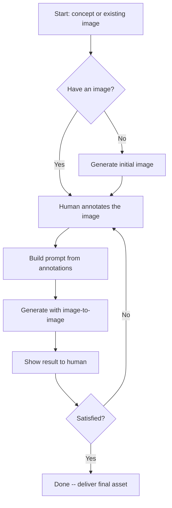
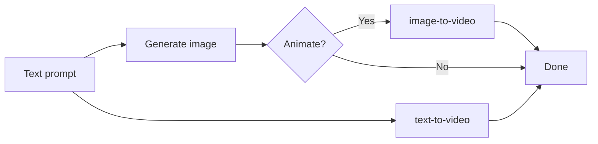

# AnyCap Media Production

> **Read this entire file before starting.** It covers the full production workflow across image, video, music, and audio -- including iterative refinement with human feedback.

Workflow guide for producing media assets with AnyCap. Covers image, video, music, and audio -- from initial generation through iterative refinement to delivery.

This skill is about **how to produce media**. For CLI command reference and parameters, read the `anycap-cli` skill.

## Prerequisites

AnyCap CLI must be installed and authenticated. Read the `anycap-cli` skill if setup is needed.

## Quick Reference

| Media | Generate | Refine | Typical duration |
|-------|----------|--------|------------------|
| Image | `anycap image generate` | Annotate + image-to-image | 5-30s |
| Video | `anycap video generate` | Re-generate with adjusted params | 30-120s |
| Music | `anycap music generate` | Re-generate with adjusted prompt | 30-90s |
| Audio | Coming soon | -- | -- |

All generation commands follow the same pattern:

```
1. Discover models    anycap {cap} models
2. Check schema       anycap {cap} models <model> schema [--mode <mode>]
3. Generate           anycap {cap} generate --model <model> --prompt "..." -o output.ext
```

Always use `-o` with a descriptive filename.

## Image Production

### Text-to-Image

Generate an image from a text prompt:

```bash
anycap image generate \
  --prompt "a cozy home office with a wooden desk, laptop, coffee cup, and plants by the window" \
  --model nano-banana-2 \
  -o workspace-v1.png
```

### Image-to-Image (Edit / Transform)

Use `--mode image-to-image` with a reference image to edit or transform an existing image:

```bash
anycap image generate \
  --prompt "make it a watercolor painting" \
  --model nano-banana-2 \
  --mode image-to-image \
  --param images=./photo.png \
  -o photo-watercolor.png
```

Reference images can be local paths or URLs. The CLI handles upload automatically.

### Multiple Reference Images

Some models accept multiple reference images for style transfer, composition blending, or subject-driven generation. Use JSON array syntax to pass multiple files:

```bash
# Combine style from one image with composition from another
anycap image generate \
  --prompt "merge the architectural style of the first image with the color palette of the second" \
  --model nano-banana-2 \
  --mode image-to-image \
  --param images='["./style-ref.png","./color-ref.png"]' \
  -o blended.png

# Mix local files and URLs
anycap image generate \
  --prompt "a portrait in the style of the reference images" \
  --model nano-banana-2 \
  --mode image-to-image \
  --param images='["./local-ref.png","https://example.com/style-ref.jpg"]' \
  -o portrait-styled.png
```

Tips:
- Use JSON array syntax `'["path1","path2"]'` -- repeating `--param images=` overwrites rather than appends.
- Local file paths inside the array are auto-uploaded, same as single-file mode.
- Not all models support multiple references. Check the model schema first. When unsupported, the model typically uses only the first image.

### Iterative Refinement with Annotation

When text prompts alone cannot describe the desired edit precisely ("move this", "remove that specific thing", "change the color of this area"), use the annotation workflow. For the full annotation guide -- including URL/video review, headless access, recording analysis, and multi-user collaboration -- read the `anycap-human-interaction` skill.



#### Step 1: Generate or Use an Existing Image

```bash
anycap image generate \
  --prompt "a landing page hero banner with mountains and sunrise" \
  --model nano-banana-2 \
  -o banner-v1.png
```

#### Step 2: Annotate

Open the annotation tool so the human can visually mark regions, describe desired changes, and optionally record a narrated walkthrough. Multiple users can collaborate on the same session in real-time.

**For agent workflows** (non-blocking, recommended):

```bash
anycap annotate banner-v1.png --no-wait -o banner-v1-annotated.png
# Returns: {session, url, poll_command, stop_command}
```

Show the URL to the human and ask them to annotate. Multiple people can open the same URL to collaborate. Wait for the human to confirm they are done, then:

```bash
# Fetch the result (single call, no loop)
anycap annotate poll --session <session_id>

# If recording exists, analyze it for visual understanding
anycap actions video-read --file .anycap/annotate/<session_id>/recording.webm \
  --instruction "Describe what changes the user wants"

# Clean up
anycap annotate stop --session <session_id>
```

**For interactive sessions** (human is at the terminal):

```bash
anycap annotate banner-v1.png -o banner-v1-annotated.png
# Blocks until Done click, outputs annotation JSON
```

The annotation tool supports four tools: Rectangle (`R`), Arrow (`A`), Point (`P`), Freehand (`F`). Each annotation gets a numbered marker and a text label.

#### Step 3: Build a Prompt from Annotations

The annotation output contains structured data. Translate each label into a coherent prompt:

```json
{
  "annotations": [
    {"id": 1, "type": "rect", "label": "Replace with a standing desk"},
    {"id": 2, "type": "point", "label": "Add a cat sitting here"},
    {"id": 3, "type": "freehand", "label": "This area should be a bookshelf"}
  ]
}
```

Prompt: "#1: Replace the desk with a standing desk. #2: Add a cat sitting at the marked position. #3: Transform the outlined area into a bookshelf. Keep all other elements unchanged."

Rules:
- Reference each annotation by its number (#1, #2, etc.)
- Include the human's exact label text
- Add "Keep all other elements unchanged" to preserve unmodified areas

#### Step 4: Apply the Edit

Use the **annotated image** (with visual markers) as the reference:

```bash
anycap image generate \
  --prompt "#1: Replace the desk with a standing desk. #2: Add a cat. Keep all other elements unchanged." \
  --model nano-banana-2 \
  --mode image-to-image \
  --param images=./banner-v1-annotated.png \
  -o banner-v2.png
```

#### Step 5: Iterate

If the human wants more changes, use the latest version as input and repeat from Step 2. Version filenames (`v1`, `v2`, `v3`) so the human can compare and revert.

### Image Tips

- **Start broad, refine narrow.** First generation nails the composition. Annotation iterations handle targeted adjustments.
- **One thing at a time.** If multi-region edits produce poor results, try one annotation per pass.
- **Annotated image only.** Pass only the annotated image as the reference. Most models understand numbered markers and remove them from the output.

## Video Production

### Text-to-Video

```bash
anycap video generate \
  --prompt "a cat walking on the beach at sunset, cinematic, slow motion" \
  --model veo-3.1 \
  -o cat-beach.mp4
```

### Image-to-Video

Animate a still image:

```bash
anycap video generate \
  --prompt "gentle camera pan across the landscape, wind blowing through trees" \
  --model seedance-1.5-pro \
  --mode image-to-video \
  --param images=./landscape.png \
  -o landscape-animated.mp4
```

This is powerful for combining with image generation: generate a still image first, then animate it.

### Video Production Workflow



For best results with image-to-video:
1. Generate a high-quality still image first (iterate with annotation if needed)
2. Use the final image as the reference for video generation
3. Keep the video prompt focused on motion and camera movement, not scene description

### Video Tips

- Video generation takes 30-120s. Use async execution when your runtime supports it.
- Check model schema for supported parameters (`aspect_ratio`, `duration`, etc.).
- Different models excel at different styles. Check available models with `anycap video models`.

## Music Production

### Text-to-Music

```bash
anycap music generate \
  --prompt "upbeat electronic track with synth leads and driving bass, 120 BPM" \
  --model suno-v5 \
  -o background-track.mp3
```

Music generation may return multiple clips. Extract the first:

```bash
anycap music generate --prompt "..." --model suno-v5 -o track.mp3 \
  | jq -r '.outputs[0].local_path'
```

### Music Tips

- Be specific about genre, tempo, instruments, and mood in prompts.
- Music generation takes 30-90s. Use async execution when possible.
- Check model parameters via schema -- some models support `duration`, `genre`, `tags`.

## Audio Production

Audio generation is on the roadmap and not yet available. Audio **understanding** (analysis) is available via `anycap actions audio-read`.

## Delivery

When the asset is ready, deliver using the appropriate method:

```bash
# Share via Drive (generates a shareable link)
anycap drive upload banner-final.png
anycap drive share banner-final.png

# Publish as a web page
anycap page deploy ./site-directory
```

## Multi-Media Production Example

A complete workflow producing a promotional package:

```bash
# 1. Generate hero image
anycap image generate \
  --prompt "modern SaaS dashboard with data visualizations, dark mode, purple accents" \
  --model nano-banana-2 -o hero-v1.png

# 2. Refine via annotation (agent asks human to mark changes)
anycap annotate hero-v1.png --no-wait -o hero-v1-annotated.png
# ... human annotates, agent polls result ...
anycap image generate \
  --prompt "#1: Make the chart larger. #2: Change accent color to blue." \
  --model nano-banana-2 --mode image-to-image \
  --param images=./hero-v1-annotated.png -o hero-v2.png

# 3. Create an animated version
anycap video generate \
  --prompt "slow zoom into the dashboard, data points animate in sequentially" \
  --model seedance-1.5-pro --mode image-to-video \
  --param images=./hero-v2.png -o hero-animation.mp4

# 4. Generate background music
anycap music generate \
  --prompt "ambient tech background music, minimal, clean, 90 BPM" \
  --model suno-v5 -o background-music.mp3

# 5. Deliver
anycap drive upload hero-v2.png hero-animation.mp4 background-music.mp3
```
